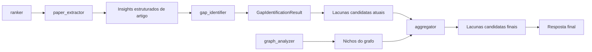
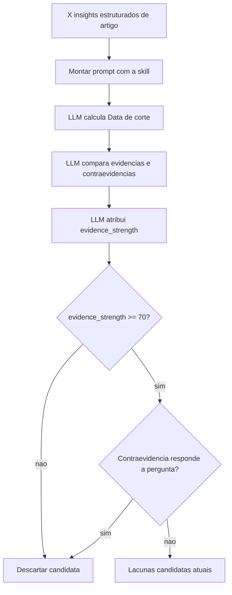
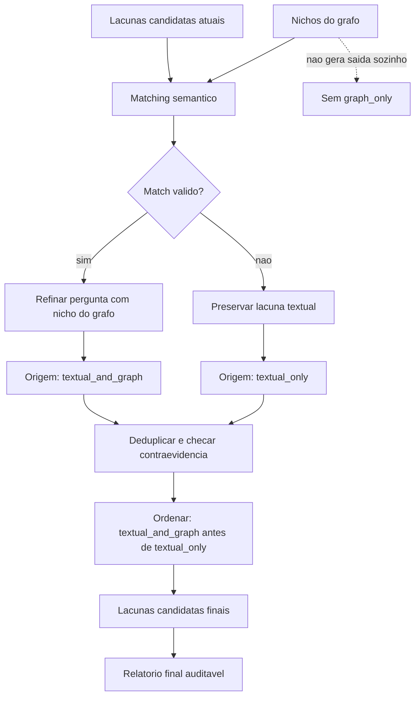

# Blocos do Vitor: gap_identifier e aggregator

Este documento descreve os dois blocos sob responsabilidade do Vitor no agente de identificacao de lacunas de pesquisa. Os termos de dominio seguem o [CONTEXT.md](../CONTEXT.md).

## Papel no pipeline

Fluxo relevante:

```text
ranker
  -> paper_extractor
  -> gap_identifier
  -> aggregator
  -> resposta final

graph_analyzer
  -> aggregator
```

O `gap_identifier` trabalha apenas com dados estruturados dos artigos. O `aggregator` combina as lacunas candidatas textuais com os nichos encontrados pelo grafo.



## Bloco 1: gap_identifier

### Responsabilidade

O `gap_identifier` recebe os X insights estruturados dos artigos e produz **Lacunas candidatas atuais**.

Uma lacuna, no dominio do projeto, e uma pergunta de pesquisa ainda nao explorada. Como o agente nao observa toda a literatura, este bloco nao deve afirmar que encontrou lacunas definitivas. Ele deve propor postulantes de lacuna sustentados pelo corpus analisado.

### Estrategia inicial de implementacao

Na primeira versao, o `gap_identifier` deve ser implementado como um no do fluxo orientado por LLM: montar um prompt completo com contexto de dominio, todos os dados estruturados dos artigos, criterios de evidencia e formato de saida esperado, e enviar esse prompt para uma chamada LLM com resposta estruturada. A propria LLM calcula a data de corte e a forca de evidencia.

Skill inicial: [`skills/research-gap-identifier/SKILL.md`](../skills/research-gap-identifier/SKILL.md).

Nesta arquitetura, a skill contem as instrucoes reutilizaveis do prompt; o `gap_identifier` e o no executavel que prepara a entrada, realiza exatamente uma chamada de LLM e valida a resposta. Nessa chamada, a LLM calcula a data de corte, compara evidencias e contraevidencias, atribui a forca de evidencia e retorna o resultado estruturado. Uma futura divisao em varias chamadas dependera de problemas observados de contexto ou qualidade e nao faz parte da versao inicial.

### Fluxo interno



### Entrada

A entrada e uma lista de **Insight estruturado de artigo** produzida pelo `paper_extractor`.

Campos obrigatorios:

- `paper_id`
- `title`
- `published_date`
- `questions_answered`
- `methodologies`
- `not_addressed`
- `stated_limitations`

O `gap_identifier` nao recebe nem interpreta `full_text`. O contrato minimo
atual do `paper_extractor` preserva os documentos convertidos em
`extracted_documents` e inicializa separadamente `extracted` com metadados e
listas analiticas vazias. A interpretacao semantica futura do artigo pertence
ao `paper_extractor`, nao ao `gap_identifier`.

As listas de um insight podem estar vazias. Uma lista vazia indica que o `paper_extractor` nao encontrou evidencia para aquele campo e nao torna o insight invalido.

Na versao inicial, o conjunto completo de `ExtractedInsights` deve ser enviado em uma unica requisicao de analise para a LLM. A identificacao de lacunas depende da comparacao entre artigos e nao pode ser reduzida a analises isoladas por artigo.

### Data de corte

A **Data de corte** e a maior `published_date` entre os artigos usados como entrada. O bloco responde: "dado o corpus observado ate esta data, quais perguntas parecem ainda nao exploradas?"

A LLM chamada pelo `gap_identifier` calcula a **Data de corte**. Ela nao deve ser recebida do `paper_extractor` nem recalculada por uma regra no codigo.

Nao usar a data de execucao do agente como criterio principal de atualidade.

Se nenhum insight estruturado for recebido, nao existe data de corte calculavel. Nesse caso, o bloco retorna `cutoff_date: null`, listas vazias e um aviso estruturado com o codigo `no_extracted_insights`.

### Evidencias aceitas

O bloco textual pode usar tres tipos de evidencia:

- limitacoes declaradas pelos autores em `stated_limitations`;
- perguntas ou escopos marcados como `not_addressed` por mais de um artigo;
- contraste entre perguntas respondidas e uma pergunta vizinha ainda nao abordada.

O bloco nao deve usar sinais do grafo. O grafo entra apenas no `aggregator`.

### Saida

A resposta da LLM e validada como `GapIdentificationResult`, contendo a data de corte, avisos e uma lista de **Lacunas candidatas atuais** que ultrapassaram o limiar minimo de forca textual. Ela nao repete os **Insights estruturados de artigo** recebidos.

O no `gap_identifier` preserva os `ExtractedInsights` originais diretamente no estado da aplicacao. Assim, a auditoria nao depende de a LLM copiar ou reescrever os dados de entrada.

Contrato alvo no estado:

```python
class GapWarning(BaseModel):
    code: str
    message: str


EvidenceType = Literal[
    "stated_limitations",
    "recurring_not_addressed",
    "contrast",
]


class CounterEvidence(BaseModel):
    paper_id: str
    description: str


class GapEvidence(BaseModel):
    paper_id: str
    evidence_type: EvidenceType
    description: str


class IdentifiedGap(BaseModel):
    research_question: str
    description: str
    evidence_strength: int
    evidence: list[GapEvidence]
    rationale: str
    counter_evidence: list[CounterEvidence]
    origin: Literal["textual_only", "textual_and_graph"] | None = None
    matched_graph_hypothesis: dict | None = None
    graph_refinement: str | None = None


class GapIdentificationResult(BaseModel):
    cutoff_date: date | None
    warnings: list[GapWarning]
    gaps: list[IdentifiedGap]


gap_identification: GapIdentificationResult | None
```

Esse campo substitui `content_gaps: list[IdentifiedGap]`. O `aggregator` recebe
o objeto completo para acessar `cutoff_date`, `warnings` e `gaps`.

Os avisos usam codigos estaveis para permitir tratamento sem interpretacao de
texto. Os codigos iniciais sao:

- `no_extracted_insights`: nenhum insight estruturado estava disponivel;
- `invalid_counter_evidence_reference`: uma contraevidencia referenciou um
  artigo inexistente e foi removida;
- `invalid_evidence_reference`: uma evidencia referenciou um artigo inexistente
  e a candidata foi descartada;
- `missing_evidence`: uma candidata nao apresentou nenhuma evidencia
  rastreavel e foi descartada.

O nome tecnico `IdentifiedGap` sera mantido por compatibilidade com o contrato
existente. Semanticamente, cada instancia continua representando uma lacuna
candidata relativa ao corpus observado, nao uma lacuna definitiva.

Os campos existentes `description` e `evidence` sao preservados, mas
`evidence` passa a ser estruturado. O calculo conceitual de
`evidence_strength` usa a escala de 0 a 100; a saida estruturada contem apenas
candidatas qualificadas com valores de 70 a 100. `cutoff_date` pertence ao
`GapIdentificationResult` e nao deve ser duplicado em cada `IdentifiedGap`.

Cada `evidence[].evidence_type` aceita somente `stated_limitations`,
`recurring_not_addressed` e `contrast`. Valores diferentes devem falhar na
validacao da resposta da LLM. `IdentifiedGap` nao possui um campo separado
`evidence_types`; os tipos sao derivados da lista de evidencias.

Cada item de `counter_evidence` deve conter `paper_id` e `description`. O
`paper_id` deve existir nos `ExtractedInsights`. Uma contraevidencia com
referencia invalida deve ser removida individualmente e gerar
`invalid_counter_evidence_reference`, sem descartar automaticamente a lacuna.

`CounterEvidence.description` deve ser uma parafrase fiel do insight
estruturado relacionado, sem citacao inventada nem informacao ausente na
entrada.

Cada item de `evidence` deve conter `paper_id`, `evidence_type` e
`description`. O campo deixa de ser texto unico e passa a ser uma lista
rastreavel por artigo. Os artigos de suporte sao derivados diretamente de
`evidence[].paper_id`; nao existe um campo separado `supporting_paper_ids`.

`GapEvidence.description` deve ser uma parafrase fiel dos campos do
`ExtractedInsights` relacionados a evidencia. Nao deve ser apresentada como
citacao literal nem acrescentar informacao ausente na entrada estruturada.

Uma evidencia com artigo inexistente ou uma lista `evidence` vazia invalida
somente a candidata afetada e gera o aviso estruturado correspondente.

Uma entrada vazia nao deve ser interpretada como evidencia de que nao existem lacunas. Ela produz resultado vazio acompanhado de aviso estruturado.

Cada candidata deve incluir:

- pergunta de pesquisa postulada;
- descricao curta;
- `evidence_strength`, de 70 a 100 na saida estruturada;
- evidencias estruturadas e seus tipos;
- justificativa;
- contraevidencias ou ressalvas, quando existirem.

A data de corte pertence ao `GapIdentificationResult`. Os artigos de suporte
sao derivados de `evidence[].paper_id`; nao existe um campo separado
`supporting_paper_ids`.

### Forca de evidencia textual

A **Forca de evidencia textual** deve ser calculada pela propria LLM. O codigo valida o formato da resposta, mas nao recalcula o score.

Fatores do score:

- recorrencia entre artigos independentes;
- qualidade do sinal textual, com limitacoes declaradas pesando mais que inferencias por contraste;
- coerencia tematica entre perguntas respondidas e escopos nao abordados;
- penalizacao por contraevidencia textual.

O score nao inclui evidencia do grafo nem impacto esperado da candidata.

Limiar inicial:

```text
evidence_strength >= 70
```

Esse limiar e informado no prompt para que a LLM retorne apenas candidatas qualificadas. Ele e um parametro inicial e pode ser ajustado apos avaliacao empirica.

### Contraevidencia

Contraevidencia textual reduz o score e deve aparecer na candidata. Ela so elimina uma candidata quando o proprio corpus observado ja responde claramente a pergunta postulada.

Exemplo:

- tres artigos dizem que nao avaliaram `X`;
- um artigo posterior responde exatamente `X`;
- resultado: a candidata deve ser descartada como lacuna atual.

Se o artigo posterior responde apenas parcialmente, a candidata pode permanecer com score menor e ressalva explicita.

## Bloco 2: aggregator

### Responsabilidade

O `aggregator` produz uma lista unica de **Lacunas candidatas finais**.

Sua funcao central e fundir nichos achados pelo grafo com possiveis lacunas identificadas nos artigos. O grafo nao cria lacunas finais sozinho; ele apenas refina ou fortalece candidatas textuais.

### Estrategia inicial de implementacao

Na versao coberta pelo PRD do `gap_identifier`, o `aggregator` faz apenas a
adaptacao minima: copia as candidatas textuais validadas, a data de corte e os
avisos para o `FinalReport`, preservando o resumo do grafo como contexto. Ele
nao realiza uma segunda chamada de LLM, ranking final ou fusao semantica.

A futura fusao entre candidatas textuais e nichos do grafo continua descrita
na skill [`skills/research-gap-aggregator/SKILL.md`](../skills/research-gap-aggregator/SKILL.md),
mas permanece fora do escopo deste PRD.

Na implementacao alvo dessa fusao, o `aggregator` deve fazer uma chamada de
LLM com saida estruturada diretamente como `FinalReport`. Nao deve existir um
`AggregationResult` intermediario montado pela LLM e posteriormente convertido
em relatorio pelo no.

Na versao inicial, o no aceita os valores devolvidos pela LLM desde que a
resposta seja valida segundo o schema de `FinalReport`. Ele nao compara nem
corrige `topic`, `cutoff_date`, `warnings`, `sources_used` ou
`papers_considered` usando os valores presentes no `GraphState`.

### Fluxo interno



### Entradas

O agregador recebe:

- lacunas candidatas atuais produzidas pelo `gap_identifier`;
- nichos do grafo produzidos pelo `graph_analyzer`;
- metadados do corpus para nota metodologica e rastreabilidade.

### Contrato utilizado do grafo

Na primeira versao, o `aggregator` recebe somente
`state.graph_insight.raw["ranked_hypotheses"]`. Ele nao envia para a LLM o
`summary`, a lista agregada de `disconnected_pairs` nem as demais metricas de
`raw`.

Cada hipotese ranqueada funciona como a representacao operacional de um
**Nicho do grafo** e pode conter os campos produzidos atualmente pelo
`graph_analyzer`:

- `concepts`;
- `missing_links`;
- `avg_similarity`;
- `cross_community`;
- `edge_count`;
- `future_bonus`;
- `base_score`;
- `score`;
- `diversified_score`;
- penalizacoes adicionadas durante o ranking.

O `aggregator` deve tratar essa lista como contexto estruturado de fusao, sem
transformar uma hipotese do grafo em lacuna final independente.

### Regras de fusao

O agregador deve comparar cada lacuna textual com os nichos do grafo.

Um match so deve ser aceito quando houver:

- sobreposicao ou equivalencia entre conceitos centrais;
- compatibilidade entre a pergunta textual e a relacao pouco explorada no grafo;
- justificativa curta de como o nicho refina a pergunta.

A fusao deve refinar a pergunta final, nao apenas aumentar prioridade.

Exemplo:

```text
Lacuna textual:
faltam estudos sobre robustez de modelos X em cenarios Y

Nicho do grafo:
X e Z aparecem relevantes, mas pouco conectados

Lacuna final fundida:
investigar robustez de modelos X em cenarios Y considerando Z, uma dimensao pouco conectada no corpus
```

### Origem da evidencia final

Cada lacuna candidata final deve declarar sua origem:

- `textual_only`: passou pelo limiar textual, mas nao teve nicho do grafo correspondente;
- `textual_and_graph`: passou pelo limiar textual e foi refinada ou fortalecida por um nicho do grafo.

Nao existe saida `graph_only`.

### Regras de descarte

Uma lacuna textual que passou pelo limiar deve entrar na resposta final, mesmo sem nicho do grafo correspondente.

O agregador so pode descartar uma candidata textual em dois casos:

- duplicata semantica de outra candidata mais forte;
- contraevidencia clara de que a pergunta ja foi respondida.

Nao descartar por falta de match com o grafo ou por parecer menos interessante.

### Ranking final

A lista final deve priorizar:

1. candidatas `textual_and_graph`;
2. candidatas `textual_only`.

Dentro de cada grupo, usar a forca do sinal disponivel. Para `textual_and_graph`, o grafo pode reforcar a prioridade, mas nao substitui o score textual.

### Saida final

O relatorio final deve incluir uma ressalva metodologica:

```text
As lacunas abaixo sao candidatas: hipoteses de perguntas ainda nao exploradas no corpus analisado ate a data de corte.
```

Para cada lacuna candidata final, apresentar:

- pergunta de pesquisa;
- origem da evidencia final;
- forca de evidencia textual;
- data de corte;
- evidencias principais com artigos;
- nicho do grafo usado na fusao, quando houver;
- contraevidencias ou ressalvas;
- justificativa curta.

O `FinalReport` deve continuar usando `gaps: list[IdentifiedGap]`. A etapa de
agregacao nao introduz um schema separado chamado `FinalCandidateGap`.
Para representar a fusao, `IdentifiedGap` deve ser expandido com os campos
opcionais `origin`, `matched_graph_hypothesis` e `graph_refinement`. O primeiro
classifica a origem final e e obrigatorio em toda lacuna final; o segundo
preserva o dict inteiro da hipotese ranqueada utilizada; o terceiro explica
como essa hipotese refinou a pergunta textual. Em `textual_only`, ambos
permanecem nulos; em `textual_and_graph`, os dois devem vir preenchidos.

## Implicacoes para implementacao

Mudancas esperadas no codigo:

- criar um schema para `StructuredPaperInsight`;
- expandir o schema de lacuna textual para incluir score, pergunta, data de corte, tipos de evidencia e contraevidencia;
- extrair `raw["ranked_hypotheses"]` de `GraphInsight` como unica entrada do
  ramo de grafo para a LLM do `aggregator`;
- implementar `gap_identifier` inicialmente como uma unica chamada LLM com prompt completo e resposta estruturada;
- implementar `aggregator` inicialmente como uma unica chamada LLM com prompt completo, sem aceitar lacunas `graph_only`;
- exigir que a resposta estruturada dessa chamada seja o `FinalReport`
  completo;
- manter `IdentifiedGap` como o schema dos itens de `FinalReport.gaps`, sem
  criar `FinalCandidateGap`;
- expandir `IdentifiedGap` com `origin`, `matched_graph_hypothesis` e
  `graph_refinement` opcionais;
- aceitar o `FinalReport` estruturalmente valido sem reconciliar seus campos
  com o estado apos a chamada;
- atualizar `render_report` para mostrar a resposta final auditavel.

Evolucao posterior:

- extrair partes recorrentes dos prompts para skills ou templates reutilizaveis;
- transformar etapas internas em subagentes somente depois que o fluxo prompt-first estiver funcionando;
- manter os subagentes alinhados aos mesmos contratos de entrada e saida usados na versao inicial.
